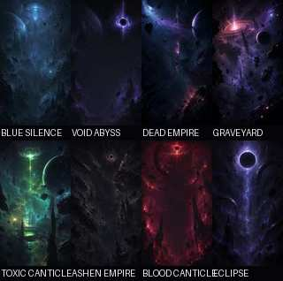

# Void Canticle — Direction artistique des backgrounds

**Projet :** Gotoo Pixel Engine — Void Canticle  
**Format cible :** SHMUP vertical 9:16  
**Source :** pack de direction artistique backgrounds  
**Base d’intégration :** `void-canticle-v3.3`

Ce dossier conserve et structure la réflexion de DA sur les environnements de Void Canticle, tout en la reliant au premier consommateur réel du checkpoint VC3.3.

## Décision VC3.3

VC3.3 possède déjà la fondation adaptée : le gameplay est rendu séparément puis composité sur un framebuffer HD 540×960. Le fond de gameplay reste cependant procédural.

Pour la première tranche :

- **VOID / ABYSS** devient le premier background authored de production ;
- l’asset runtime est `assets/void_canticle/backgrounds/void_abyss/background.png` ;
- les huit directions restent visibles comme références légères sous `concepts/` ;
- les sept autres environnements ne deviennent pas encore des assets runtime ;
- aucune abstraction générique de backgrounds, biome ou parallaxe n’est ajoutée tant qu’un second consommateur ne la justifie pas.

## Dossier de DA

La source fournie a été découpée par responsabilité pour rester navigable dans le dépôt :

- [`01_visual_bible.md`](01_visual_bible.md) — vide, monumentalité, technologie liturgique, palette, composition SHMUP, contraste ;
- [`02_environments.md`](02_environments.md) — BLUE SILENCE, VOID / ABYSS, DEAD EMPIRE, GRAVEYARD, TOXIC CANTICLE, ASHEN EMPIRE, BLOOD CANTICLE, ECLIPSE ;
- [`03_progression.md`](03_progression.md) — progression visuelle proposée sur huit stages et courbe chromatique ;
- [`04_production.md`](04_production.md) — couches, parallaxe, débris, background vivant, séparation HD / gameplay pixel ;
- [`05_asset_organization_and_guardrails.md`](05_asset_organization_and_guardrails.md) — règles de production, naming, slices, garde-fous GPE et checklist ;
- [`06_vision.md`](06_vision.md) — vision finale ;
- [`IMPLEMENTATION.md`](IMPLEMENTATION.md) — delta concret entre VC3.3 et cette première intégration.

## Principe directeur

> **Le spectacle vit à la périphérie et dans le lointain. Le centre appartient au gameplay.**

La cible reste : beauté cosmique + vide noir + menace incompréhensible, sans sacrifier la lecture instantanée du SHMUP.

## Concepts vs production

Les JPEG sous `concepts/` sont des **dérivés de revue** volontairement légers des concept arts fournis. Ils ne constituent pas un contrat runtime. Le passage d’un concept vers `assets/void_canticle/backgrounds/` doit correspondre à un stage ou slice réellement jouable.
